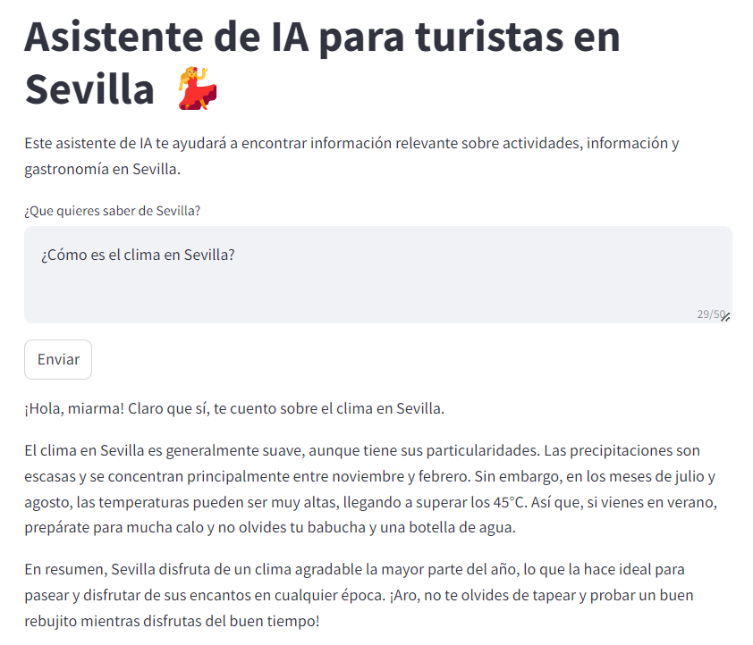

# Asistente de IA para Turistas en Sevilla 💃

Este proyecto implementa un asistente de inteligencia artificial (IA) diseñado para ayudar a turistas en Sevilla. Utilizando tecnologías de procesamiento de lenguaje natural y recuperación de información (RAG), el asistente proporciona respuestas útiles y relevantes sobre actividades, información turística y gastronomía en Sevilla.



## Características

- **Interfaz Amigable**: Una interfaz de usuario sencilla construida con Streamlit.
- **Procesamiento Avanzado de Lenguaje Natural**: Utiliza el modelo GPT-4 de OpenAI para entender y generar respuestas a las consultas de los usuarios.
- **Generación aumentada de recuperación (Retrieval Augmented Generation, RAG)**: Incorpora un sistema de recuperación de información basado en vectores para encontrar las respuestas más relevantes a partir de un conjunto de datos predefinido.


## Tecnologías Utilizadas

- **Streamlit**: Para la creación de la interfaz de usuario web.
- **OpenAI GPT-4**: Para el procesamiento y generación de lenguaje natural.
- **Chroma**: Para la gestión y recuperación eficiente de información basada en vectores.

## Configuración del Proyecto

1. **Configura las Variables de Entorno**:
Asegúrate de configurar las variables de entorno necesarias, como las claves de API para OpenAI.

2. **Instala las Dependencias**:
    ```bash
    pipenv install
    ```

3. **Ejecuta la Aplicación**:
    ```bash
    streamlit run streamlit/home.py
    ```

## Datos Utilizados

Para proporcionar información precisa y detallada, este proyecto utiliza una amplia colección de documentos PDF sobre Sevilla. Estos documentos incluyen guías turísticas, folletos informativos, hoteles, gastronomía utilizados para para extraer información relevante que alimenta al asistente de IA.


## Uso

Una vez que la aplicación esté ejecutándose, navega a la URL proporcionada por Streamlit. Simplemente escribe tu pregunta sobre Sevilla en el área de texto y haz clic en "Enviar" para recibir información relevante.