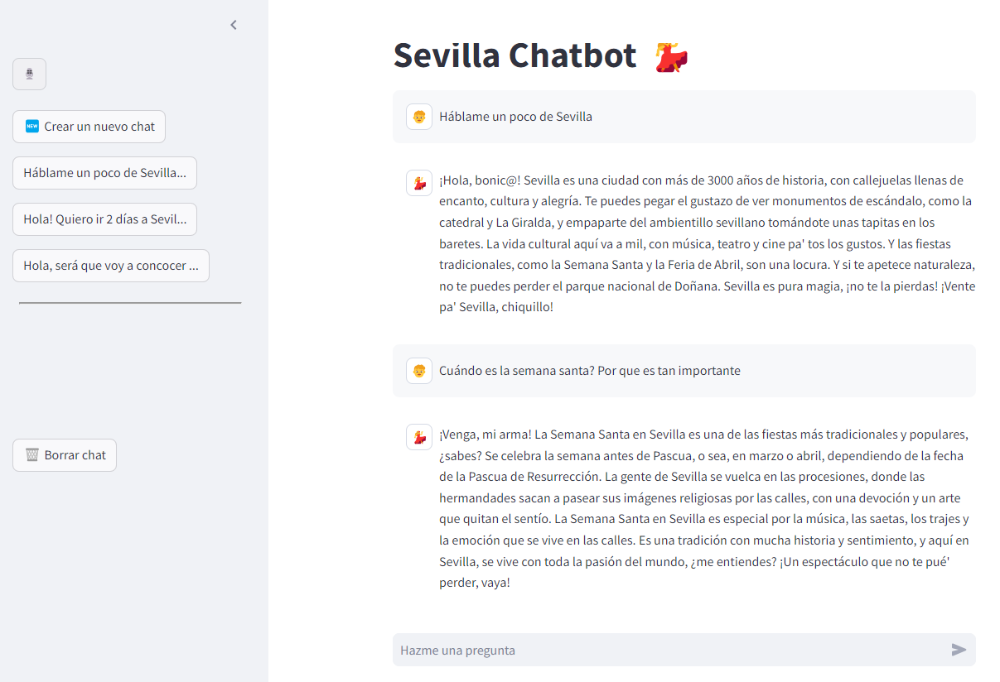

# Asistente de IA para Turistas en Sevilla (Fine tunning + RAG)

Este proyecto implementa un asistente de inteligencia artificial (IA) diseñado para ayudar a turistas en Sevilla. Aprovechando tecnologías avanzadas de procesamiento de lenguaje natural y recuperación de información (RAG), este asistente proporciona respuestas útiles sobre actividades, información turística y opciones gastronómicas en Sevilla. Un aspecto distintivo de nuestro asistente es su capacidad para entender y generar respuestas con un toque local auténtico, gracias a un proceso de fine-tuning del modelo GPT-3.5 utilizando un dataset único basado en videos de YouTube de una hablante nativa andaluza.


## Capturas de Pantalla para Chatbot app

##


##


## Características

- **Interfaz Amigable**: Una interfaz de usuario sencilla construida con Streamlit.
- **Fine Tunning del modelo gpt-3.5-turbo-1106**: Entrenado con un dataset único basado en videos de YouTube de una hablante nativa andaluza.
- **Generación aumentada de recuperación (Retrieval Augmented Generation, RAG)**: Incorpora un sistema de recuperación de información basado en vectores para encontrar las respuestas más relevantes a partir de un conjunto de datos predefinido.

## Funcionalidades
- Chat de Texto y Audio: Permite a los usuarios hacer preguntas mediante entrada de texto o grabaciones de audio.
- Historial de Chat: Guarda y carga el historial de chat para proporcionar contexto en las respuestas.
- Actualización de Nombre del Chat: Actualiza el nombre del chat basándose en las primeras palabras de la pregunta del usuario.
- Eliminación de Chats: Permite eliminar chats y su historial correspondiente.

## Base de Datos
La base de datos SQLite se utiliza para almacenar el historial de chat y gestionar las operaciones CRUD (Crear, Leer, Actualizar, Eliminar).
Las funciones relacionadas se encuentran en:
```bash
    database/sqlite/database.py
```


## Tecnologías Utilizadas

- **Streamlit**: Para la creación de la interfaz de usuario web.
- **OpenAI GPT-4**: Para el procesamiento y generación de lenguaje natural.
- **Chroma**: Para la gestión y recuperación eficiente de información basada en vectores.


## Proceso de Fine-Tuning
- **Descarga de audio de videos de YouTube**.
- **Conversión de Audio a Texto**.
- **Creación de Dataset**: Crea un dataset de preguntas y respuestas basado en el texto extraído.
- **Conversión de Dataset a JSONL**: Convierte el dataset en un formato JSONL para el entrenamiento.


## Configuración del Proyecto

1. **Configura las Variables de Entorno**:
Asegúrate de configurar las variables de entorno necesarias, como las claves de API para OpenAI.

2. **Instala las Dependencias**:
    ```bash
    pipenv install
    ```

3. **Ejecuta la Aplicación**:
    ```bash
    python database/create_database.py
    streamlit run streamlit/home.py
    ```

## Datos Utilizados para RAG
Este proyecto utiliza una colección de documentos PDF sobre Sevilla. Estos documentos incluyen guías turísticas, folletos informativos, hoteles, gastronomía utilizados para para extraer información relevante que alimenta al asistente de IA.


## Uso
Una vez que la aplicación esté ejecutándose, navega a la URL proporcionada por Streamlit. Simplemente escribe tu pregunta sobre Sevilla en el área de texto y haz clic en "Enviar" para recibir información relevante.